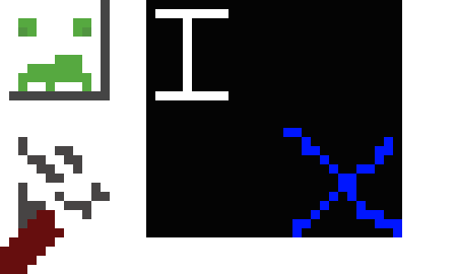
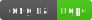
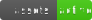
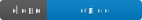

# InternetX Assets

<h2 align="center">InternetX Assets how images and resources</h2>

## About this repository

This repository haves assets that have been used on [InternetX](https://github.com/InternetX-browser/InternetX.com).

## Assets Library

Here you have ones assets that have been used here.

### [Readme > Main](./assets/readme/main/)

## Our Contributors

## Completed

- [x] Readme Images
- [ ] InternetX Images
- [ ] Site images
- [ ] Asset's readme